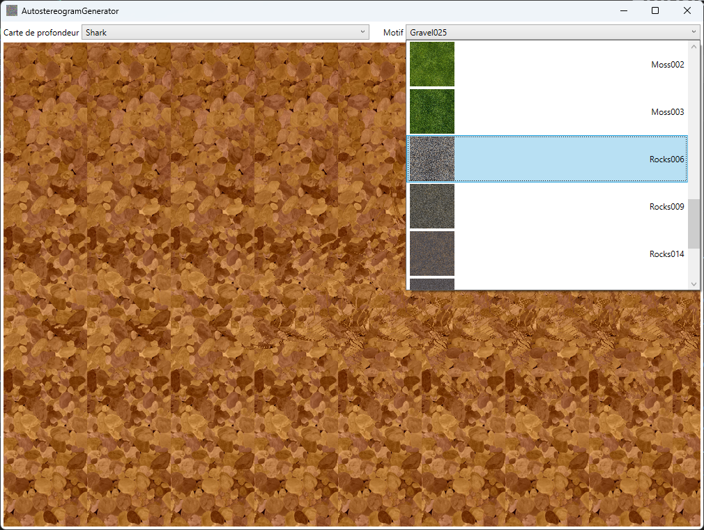

# AutostereogramGenerator
A simple autostereogram generator

## Usage
```C#
var autostereogramGenerator = new AutoStereogramGenerator(depthMap, optionalPattern);
var autostereogram = autostereogramGenerator.Create();
autostereogram.SaveAsPng(saveFileName);
```

[](https://www.nuget.org/packages/Autostereogram)

## Have fun
You can also download and have fun with the [AutostereogramGenerator application](https://github.com/kakone/AutostereogramGenerator/releases) :

